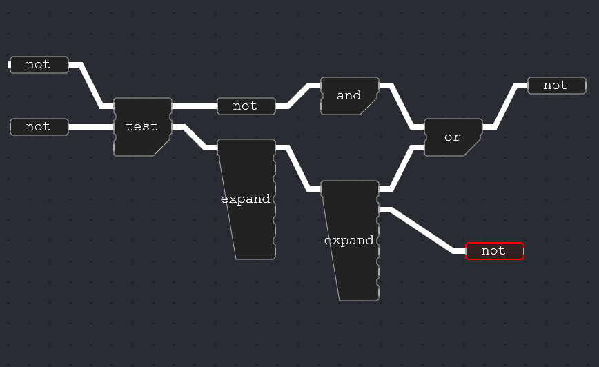

# GEON-NODES


# what is it 

A component of my master thesis involves a flowchart-application or VPL (Visual Programming Language). I couldn't find any web-based flowchart api which satisfied the requirements, so I set out to create a new one.

# Demo

[Here](https://josfeenstra.nl/project/nodes)


# Roadmap MVP
> status 
> 🚧: Busy
> ⏹️: On hold
> ✔️: Done 

===============================================================================

# PHASE 1
- TODO

===============================================================================

# PHASE 2

## STEP 1 : THE VPL;

- Visuals
  - [✔️] Try to make the functions look a bit nicer and 'chunkier'
  - [✔️] Mute the colors, to prepare for some other color coding

- quality of life
  - [✔️] double click menu
     - [✔️] MVP
     - [] _extra: nicer popup window_
     - [] _extra: filters_
     - [] _extra: autocomplete_
  - [🚧] copy-pasting (parts of) the flowchart
    - _note: I broke this again during the cable refactor..._
    - [ ] partial copying
    - [ ] partial pasting
    - [ ] duplicate (Ctrl + D / D)
    - [ ] cable copy-pasting 
  - [✔️] history & ctrl Z & Y support 
  - [✔️] cable history
     - [ ] fix minor bugs
  - [🚧] Cable Refactor
    - [✔️] We need a better definition and representation of variables. 
    - [✔️] Must be easier for state management and history
    - [✔️] Must be easier to reason about
    - [✔️] Must be easier to translate to js / json or whatever
    - [ ] Deal


# STEP 2 : ADVANCED MODULE LOADING & INTRODUCTION OF TYPES

- Module Loading
  - [✔️] Dynamically load js, 
  - [✔️] build a LibraryShim so we can reason about it
  - [ ] Rework the library shims  
  - [ ] Load `*.d.ts` header files. 
    - [ ] Ensure type savety from these headers
    - [ ]  
  - [✔️] Load a WebAssembly module created using wasm-pack       

- Types 
  - [ ] How to represent basic types ? 
  - [ ] How to represent nested types (a list of numbers)
  - [ ] How to represent custom types ? (== structs | interfaces | classes)
  - [ ] How to show this on the canvas ?  
     - [ ] Introduce a Variable Node 


# STEP 3 : INPUT AND OUTPUT

- Using the types of step 2

- [ ] introduce VariableBlueprint -> Generates VariableNode 
- [ ] Make a 'file drop' widget
- [ ] Make a 'visualize geometry' widget
- [ ] How to make users determine inputs & outputs ?

- [ ] Try to 

> ### Some brainstorming
> Some categories are emerging. 
> 1. Flow-language features 
> - history, copy-pasting, loops, json editing, 
> - idea for json: use the ideas generated in the 'gazelle' grasshopper plugin
> - idea for loops: use nested lists, NOT TREES, and use the idea of a loop-box
> 
> 
> 2. Module loading and conversion 
> - How to deal with classes? types? non-pure functions? 
> 
> 
> Things which affect both: 
>
>

===============================================================================

# PHASE 3 


===============================================================================

# PHASE 4


===============================================================================

# NICE TO HAVES / could have's 
- [ ] refactor visuals to css
   - because right now, the drawing of the canvas requires a lot of render calls, and is slow on less-powerful pc's. Not accessible.

- [ ] refactor Operations / Widgets
    - [✔️] Core -> Blueprint 
    - [✔️] rename Operations to FunctionBlueprint -> Generates FunctionNode
- [ ] introduce widget -> Is a Node with a lit component instance attached  
      in a box
  - [ ] HTML widgets / Lit Widgets
  - [ ] A widget can be reduced to just a Variable
  - [ ] A LitWidget can use a number of hooks to declare output variables.

# Notes
> why not just use a type property in the json

-------------------------------------------------------------------------------

# OTHER THINGS TO DO


## Utility 🚧
The Utilities are still not completely done: 
- NO UI idea: lets try to do everything with drop downs, and context-aware menu's. 

### Menu Overhaul
- [ ] use lit or something
- [ ] build homepage, tabs, settings page, dropdown menu's, etc.
- [ ] double click -> add component functionality
- [ ] right click menu
  - [ ] on empty
  - [ ] on cable
  - [ ] on block
  - [ ] on selection
- [ ] One settings page, nothing more
- [ ] Paint / Visualize window

### Quality of Life Graph Editing
- [ ] Copy & Paste parts of the flowchart 🚧
  - [✔️] create a json encoding of node instances
  - [✔️] make copy, paste, load & save use this encoding instead.
  - [✔️] hook up load, save, new, export, import buttons 
  - [ ] implement the 'addgraph' method, and deal with things like overlapping connections
  - [ ] place them correctly, create new GUIDS if the old ones exist
  - [ ] figure out how cables should behave
- [✔️] Undo and Redo behaviour 🚧
  - [✔️] Create a stack of changes. 
  - [ ] undo and redo cables

### Cables
- [ ] Selectable Cables 
  - [ ] To preview or delete  
- [ ] cable hooks for cable management

- [✔️] Fix box-selecting


### Rendering Overhaul 
- [ ] CSS based rendering


<br>

## Create multiple nodes & std plugins 🚧
Immediately going to geometry seems a step too far from pretty much only boolean operators. Lets create some in-between steps, some nodes we eventually want to use.

### widgets
- [ ] slider / dynamic number widget. 
  - How to set Start, Stop and Step? 
  - Where does the slider live? does it even has to be on the canvas? Why not a separate panel? 
  
- [ ] json creation / input
- [ ] json traversal
- [ ] json editing 
- [ ] type checking / conversion ?

<br>

## Phase 4 - Technicalities 🚧
At this point (phase 2.5) we have already overcome a number of challenging technical challenges. However, many more remain. These aspects need a clear solution before we can proceed. 

<br>

### 4.1 Types

- [ ] figure out how type checking is going to work. 
  - This could go in any number of directions 
  - auto template checking? will we allow only jsons?  

> Cables are the equivalent of variables. Cables will have to be aware of their type. This is a nice starting point to start thinking from. 

> IDEA: json-only approach: all data is a json. 
> Types will just be a keyword or name with a corresponding json-template
> This template will have to be run once per cable (if type-checking / strict mode is on) 
>
> Why: fully embrace and utilize the fact that we are geoprocessing in javascript.
> 

<br>

### 4.2 Lists & Looping 

- [ ] how to loop on the canvas?
- [ ] is a `[x,y,z]` point the same as a [2.0,3.0,4.0] list? how 'low-level' will we make our data?
- [ ] Loop Box

> Lists and looping, these are things visual programming languages struggle to do / represent. every VPL does this a little differently. We require a solution which:
> Enables us to preview in-between results clearly
> Enables us to do complex operations


<br>

### 4.3 Dynamic Plugins / Libraries / Modules Loading

- [ ] the dynamic library loading is hacky at the moment, this needs to be improved.
- [ ] make a nodes-module using WASM, see if that works

> think about multiple libraries / hierarchy 
>   - enforce pure functions ? 
>   - hoe werken interne libraries / std ? 
>   - hoe werken externe libraries / plugins ?
>     - DESIGN PRINCIPLE: maak STD met precies dezelfde infrastructuur als non-std 
> - hoe tonen & catagoriseren we verschillende libraries ?
>   - DONE
  
<br>

### 4.4 HTML Widgets
The current widgets are not properly scalable, and hard to maintain. 

> IDEA: embed html. use `custom data attributes` to communicate back & forth.
> This means that we can create widgets using html + css + js, separately, and load them either in the canvas, or somewhere else. Js frameworks, such as Vue could be used to facilitate this behaviour.  

<br>

## Phase 5 - Geometry 🛑
> Note: unsure about this part
- Make this application ready for geo business & wasm. 
  - Make the components accept json-serializable data. 
    - The Json, and more specifically the serde::Value enum, will be the standard for all data transfer between components. 
    - This will make all json-based data (cityjson, WFS, user-submitted) first-class citizens within this environment.
    - This solves a number of problems that will come up later.
- Add a mesh visualizer

Serde::Value looks like this
```rust
pub enum Value {
    Null,
    Bool(bool),
    Number(Number),
    String(String),
    Array(Vec<Value>),
    Object(Map<String, Value>),
}
``` 
could be used to represent basicly anything. It will be the function's problem to deserialize these values.

> Note: what am i doing? this is just a normal js Object. lets just use that, but gain full control over it

<br>

## Phase 6 - Geospatial 🛑
> A Sketch

- [ ] Add the cj-val-rs wasm binary to this flowchart tool.
- [ ] Load various cityjsons, and validate them using the flowchart
- [ ] Analyze and visualize the mistakes within the cityjson
- [ ] Parse **\[TO BE DETERMINED\]** library as a plugin to this environment.

<br>

## Phase 7 - Usage 🛑
- [ ] create 3 useful applications with this environment, and publish it so it can be used.  

<br>

# Status
In phase 2 is done! 

