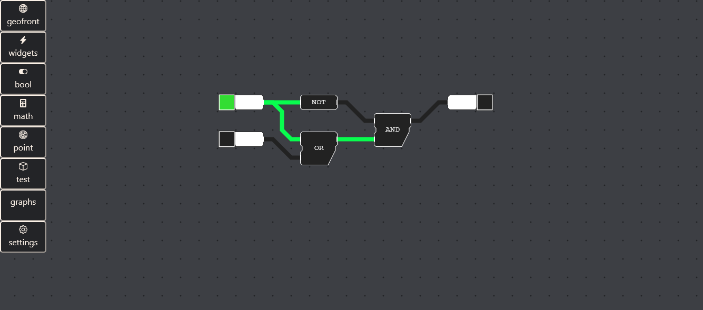

# FRI | 5 nov 2021

Prototype status: all sorts of different things are possible at the moment. js - script conversion, saving to and loading from json. Objects, button gizmo's, log console, text input, etc. 

Right now, mostly working on P2 paper. consequently, little progress with the flowchart application. 

I am considering a do-over of a lot of features. We need svg based rendering in my opinion.  SVG's would allow us to: 
- Re-render things less. We can just rely on browser-based scrolling. This has got to be more efficient than the Canvas based scrolling we are doing right now. 
- This plays nicer with the browser as a GUI environment. canvas API is great for rendering images dynamically, but we will be dealing with vector graphics. 
- use CSS for styling the components, allowing easy re-skins
- clicking on things using the svg boundaries, cuz why not

